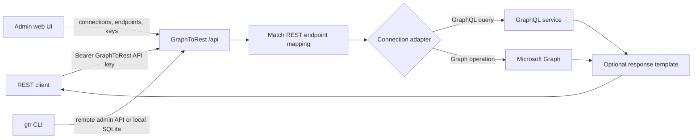

# GraphToRest

GraphToRest turns supported GraphQL queries and Microsoft Graph operations into
small, stable REST endpoints. Consumers call ordinary `/api/*` routes with a
GraphToRest API key; they do not need to know GraphQL, Microsoft Graph, OAuth,
or the upstream response shape.

GraphToRest includes:

- an admin web UI for connections, credentials, REST endpoints, API keys,
  testing, and request activity;
- a `gtr` CLI for the same administration workflows, automation, and direct
  SQLite access;
- automatic GraphQL schema introspection and a curated Microsoft Graph
  operation set;
- YAML export/import for reviewable, portable endpoint definitions;
- a generated OpenAPI document and in-browser API explorer;
- managed or caller-supplied upstream authentication;
- per-key rate limits, per-endpoint response caching, structured logs, and an
  activity view.

> GraphToRest is currently version 0.1. Review the [current
> limitations](#current-limitations) before using it as a public production
> gateway.

## Why use it?

GraphToRest is useful when an upstream API is capable but inconvenient for its
consumers.

| Use case | What GraphToRest adds |
| --- | --- |
| A frontend or integration only needs a few GraphQL queries | A small REST surface with predictable URLs and response fields |
| Consumers should not carry GraphQL documents | The query stays inside a server-managed mapping |
| Microsoft Graph authentication should be centralized | Encrypted managed credentials and gateway-owned token refresh |
| Different upstream fields should become a stable internal contract | Response templates rename and select fields |
| A legacy client only speaks REST | HTTP methods, path parameters, JSON responses, and OpenAPI discovery |
| Teams need controlled access to an upstream service | Separate GraphToRest API keys, rate limits, activity records, and revocation |
| Endpoint definitions need review and promotion between environments | YAML export/import with atomic validation |

It is not intended to mirror every upstream operation automatically. The goal
is a deliberate REST facade over the subset clients should use.

## How it works



A published endpoint has four main parts:

1. **REST route** — for example `GET /users/{id}`, publicly available as
   `GET /api/users/{id}`.
2. **Connection** — the upstream service and its authentication mode.
3. **Operation** — an adapter-specific GraphQL query or Microsoft Graph
   `get`, `list`, or `batch` operation.
4. **Response behavior** — pass through the upstream JSON or return a flat
   object built from `$.field.path` values.

The saved recipe is called a *mapping*. The UI presents mappings primarily as
published REST endpoints.

### Source schema versus generated OpenAPI

These are two different schemas:

- **Upstream discovery:** for a GraphQL connection, GraphToRest reads the
  introspection schema from the configured GraphQL endpoint. For Microsoft
  Graph, it uses a curated set of supported operations. An upstream Swagger
  file is not required or imported.
- **Published REST contract:** after mappings exist, GraphToRest generates its
  own OpenAPI 3 document at `/api/openapi.json`. The API explorer uses that
  document and sends requests to `/api`.

The current OpenAPI output documents routes, HTTP methods, path parameters,
and supported Microsoft Graph query parameters. Response bodies are currently
described as generic JSON objects rather than full inferred response schemas.

## Quick start with Docker

### Prerequisites

- Docker with Docker Compose
- OpenSSL for the key-generation commands below

Clone and start the service:

```bash
git clone https://github.com/grrttmrtn1/GraphToRest.git
cd GraphToRest

export CREDENTIAL_ENCRYPTION_KEY="$(openssl rand -hex 32)"
export GTR_BOOTSTRAP_ADMIN_USERNAME=admin
export GTR_BOOTSTRAP_ADMIN_PASSWORD="$(openssl rand -base64 18)"
echo "Save this one-time admin password: $GTR_BOOTSTRAP_ADMIN_PASSWORD"

docker compose up -d --build
```

Open <http://localhost:3000>, sign in as `admin`, and use the password printed
above. Remove the bootstrap variables from the runtime environment after the
first admin has been created. They only take effect while no admin exists.

The Compose file binds to `127.0.0.1:3000` by default. Put a TLS-terminating
reverse proxy in front of GraphToRest before exposing it outside the host.

### Persist configuration safely

For repeated local starts, place environment values in an untracked `.env`
file. `.env` and `docker-compose.override.yml` are ignored by Git.

```dotenv
CREDENTIAL_ENCRYPTION_KEY=<64 hex characters from openssl rand -hex 32>
PUBLIC_BASE_URL=http://localhost:3000
GTR_BOOTSTRAP_ADMIN_USERNAME=admin
GTR_BOOTSTRAP_ADMIN_PASSWORD=<a unique 12+ character first-run password>
```

Keep `CREDENTIAL_ENCRYPTION_KEY` backed up in a secret manager. Losing it makes
stored managed credentials unreadable. Do not commit `.env`, API keys, vendor
tokens, client secrets, or database files.

## First endpoint in the web UI

The UI is the simplest way to learn the workflow.

1. **Connections → New connection**
   - Choose `GraphQL` or `Microsoft Graph`.
   - Choose `Pass through client token` or `Managed by gateway`.
   - A GraphQL connection also needs its HTTPS endpoint URL.
2. **Credentials** (managed connections only)
   - Enter client credentials.
   - For authorization-code grants, save the application details and then
     select **Authorize** to complete user consent.
3. **Endpoints → Create REST endpoints**
   - GraphQL discovery introspects the configured endpoint.
   - Microsoft Graph loads the supported curated operations.
   - Passthrough connections require a temporary vendor token for discovery;
     it is used for that request and is not stored.
4. **Review or customize an endpoint**
   - Select its route to edit the method, path, operation, response template,
     or cache TTL.
   - Editing the route, operation, or response makes it manual. Later
     discovery protects manual changes unless overwrite is explicitly enabled.
5. **API keys → Create API key**
   - Copy the plaintext key when it is shown; GraphToRest never displays it
     again.
   - Optionally set a per-key request rate and burst size.
6. **API explorer**
   - Paste the GraphToRest API key and execute a published endpoint.
7. **Activity**
   - Review status, latency, connection, API-key label, and normalized error
     codes without storing request bodies, headers, or query strings.

### UI screen guide

| Screen | Purpose |
| --- | --- |
| Connections | Add upstream services and choose adapter/authentication behavior |
| Connection overview | Inspect connection metadata or remove the connection and its endpoints |
| Credentials | Store encrypted OAuth client details and complete authorization-code consent |
| Endpoints | Discover upstream operations, publish REST routes, edit mappings, and import/export YAML |
| API keys | Create, rate-limit, update, and revoke consumer credentials |
| API explorer | Browse the generated OpenAPI document and make real `/api/*` calls |
| Activity | Inspect recent gateway requests and errors |

Genuine application screenshots are not currently checked into the repository.
The UI is served by the quick start above; screenshots should be captured from
a running release so they remain consistent with the shipped interface.

## Connections and authentication

### Supported adapters

| Adapter | Connection config | Discovery behavior | Operation shape |
| --- | --- | --- | --- |
| `graphql` | `{ "endpoint": "https://api.example.com/graphql" }` | GraphQL introspection; generates a conservative subset of query routes | `{ "query": "...", "variables": { "id": "$params.id" } }` |
| `microsoft-graph` | none | Built-in curated routes for users, groups, messages, events, drive items, teams, delta, and a user overview batch | `{ "kind": "get|list|batch", ... }` |
| `mock` | none | One development/test user route | Mock query object |

### Authentication modes

| Mode | Best for | Upstream token behavior |
| --- | --- | --- |
| `passthrough` | Per-user upstream authorization | The caller sends `X-Vendor-Token` on each `/api/*` request. GraphToRest does not store it. |
| `managed` | Service accounts or centrally authorized access | GraphToRest stores encrypted OAuth client details, obtains/refreshes tokens, and calls upstream as the managed identity. |

Managed authentication requires `CREDENTIAL_ENCRYPTION_KEY`. Generic GraphQL
OAuth credentials use `clientId`, `clientSecret`, `tokenUrl`, optional scopes,
and `authorizeUrl` for authorization-code grants. Microsoft Graph credentials
use `clientId`, `clientSecret`, `tenantId`, optional scopes, and the selected
grant.

For authorization-code grants, configure this redirect URI in the upstream
OAuth application:

```text
<PUBLIC_BASE_URL>/admin/oauth/callback
```

## Calling a published endpoint

Create a GraphToRest API key in the UI or CLI, then call a managed connection:

```bash
export GTR_API_KEY='<plaintext key shown once at creation>'

curl --fail-with-body \
  -H "Authorization: Bearer $GTR_API_KEY" \
  http://localhost:3000/api/users/123
```

For a passthrough connection, also supply the caller's upstream token:

```bash
export UPSTREAM_TOKEN='<short-lived vendor access token>'

curl --fail-with-body \
  -H "Authorization: Bearer $GTR_API_KEY" \
  -H "X-Vendor-Token: $UPSTREAM_TOKEN" \
  'http://localhost:3000/api/msgraph/users?select=id,displayName&limit=25'
```

`Authorization` authenticates the caller to GraphToRest. `X-Vendor-Token`
authenticates a passthrough request to the upstream service. They are separate
credentials.

## Mapping and YAML format

The safest authoring workflow is:

1. discover endpoints from a connection;
2. export their YAML;
3. edit the export;
4. import it again.

Imports are atomic: if one entry is invalid, nothing is written. An entry with
an existing `id` updates that mapping. Omitting `id` creates a new manual
mapping. `connection` must exactly match an existing connection name, and
`auth` must currently be `inherit`.

```yaml
- route: GET /users/{id}
  connection: customer-directory
  source: manual
  operation:
    query: "query($id: ID!) { user(id: $id) { id name email } }"
    variables:
      id: $params.id
  response:
    shape: template
    template:
      id: "$.user.id"
      name: "$.user.name"
      email: "$.user.email"
  auth: inherit
  cacheTtlSeconds: 60
```

Field reference:

| Field | Meaning |
| --- | --- |
| `id` | Optional existing mapping ID. Include to update; omit to create. |
| `route` | HTTP method plus a path beginning with `/`. `{name}` captures a path parameter. |
| `connection` | Exact existing connection name. |
| `source` | Export metadata (`generated` or `manual`). Imports become manual. |
| `operation` | Adapter-specific object sent upstream. GraphQL variables can reference `$params.<name>`. |
| `response.shape` | `passthrough` or `template`. |
| `response.template` | Flat output-name to `$.field.path` map, required for `template`. |
| `auth` | Must be `inherit`; per-mapping auth overrides are not implemented. |
| `cacheTtlSeconds` | Optional integer from 0 to 86400; 0 disables caching. The server-wide maximum may cap it further. |

Microsoft Graph single-resource example:

```yaml
- route: GET /directory/users/{id}
  connection: microsoft-365
  source: manual
  operation:
    kind: get
    path: /users/{id}
  response:
    shape: template
    template:
      id: "$.id"
      displayName: "$.displayName"
      mail: "$.mail"
  auth: inherit
```

## CLI

The CLI supports remote and embedded modes. See
[apps/cli/README.md](apps/cli/README.md) for the compact command reference.

### Run the CLI

From the Docker image:

```bash
docker compose run --rm --entrypoint gtr graphtorest status
```

From a source checkout:

```bash
npm ci
npm run build
node apps/cli/bin/gtr.js status
```

If the package is linked or installed so its binary is on `PATH`, replace
`node apps/cli/bin/gtr.js` with `gtr` in the examples below.

### Remote mode

Remote mode uses a running server's `/admin/*` API:

```bash
gtr login --server https://graphtorest.example.com --username admin
gtr status
gtr connection list
gtr activity --limit 25
gtr logout
```

The saved session profile is written with mode `0600` under
`~/.config/graphtorest/cli.json` by default. `GTR_SERVER`, `GTR_TOKEN`,
`GTR_PROFILE_PATH`, and `XDG_CONFIG_HOME` support automation and custom profile
locations. `GTR_ADMIN_PASSWORD` can supply a login password non-interactively;
prefer a secret-injection mechanism rather than shell history.

### Embedded mode

With no remote server option/profile, the CLI works directly against SQLite:

```bash
gtr --db ./data/graphtorest.db status
gtr --db ./data/graphtorest.db admin create --username admin
gtr --db ./data/graphtorest.db mapping export --out mappings.yaml
```

Embedded managed-credential commands require the same
`CREDENTIAL_ENCRYPTION_KEY` used by the server. Avoid editing a running
server's database in embedded mode; in-memory cache state will not immediately
observe direct database changes.

### Common CLI workflow

```bash
# Create a passthrough GraphQL connection.
gtr connection create \
  --name customer-directory \
  --adapter-type graphql \
  --auth-mode passthrough \
  --config '{"endpoint":"https://api.example.com/graphql"}'

# Introspect it and publish supported REST endpoints.
gtr mapping generate \
  --connection customer-directory \
  --vendor-token "$UPSTREAM_TOKEN"

# Review or version the endpoint definitions.
gtr mapping list --connection customer-directory
gtr mapping export --connection customer-directory --out mappings.yaml
gtr mapping import mappings.yaml

# Create a consumer key with a rate limit.
gtr apikey create --label integration-a --rate-limit 60 --burst 10
```

Create managed credentials from a file so the client secret does not appear in
shell history:

```bash
gtr connection credentials set customer-directory \
  --credentials-file ./credentials.json
gtr connection credentials status customer-directory
gtr connection authorize customer-directory  # authorization_code, remote mode only
```

Top-level command families:

```text
gtr login | logout | status
gtr connection create | list | show | delete
gtr connection credentials set | status | clear
gtr connection authorize
gtr mapping create | list | update | delete | generate | export | import
gtr apikey create | list | update | revoke
gtr admin create | set-password
gtr adapters
gtr activity
```

Use `gtr <command> --help` for every option and `--json` for machine-readable
output. Destructive commands prompt interactively; pass `--yes` in controlled
automation. Exit codes are 0 success, 1 general error, 2 usage, 3 auth, 4 not
found, and 5 conflict. Set `GTR_DEBUG=1` for stack traces.

## Configuration reference

All server configuration is supplied through environment variables.

| Variable | Default | Description |
| --- | --- | --- |
| `PORT` | `3000` | HTTP port. |
| `DB_PATH` | `./data/graphtorest.db` (`/data/graphtorest.db` in Docker) | SQLite database path. |
| `API_ENABLED` | `true` | Set `false` to disable `/api/*`. |
| `ADMIN_ENABLED` | `true` | Set `false` to disable `/admin/*` and its web administration surface. |
| `WEB_ENABLED` | `true` | Set `false` to stop serving the built UI while retaining the admin API. |
| `CREDENTIAL_ENCRYPTION_KEY` | unset | 32-byte key as 64 hex characters or base64. Required for managed auth. |
| `PUBLIC_BASE_URL` | `http://localhost:<PORT>` | External origin used for OAuth callbacks, secure-cookie behavior, and CSRF origin checks. |
| `ACTIVITY_RETENTION` | `1000` | Number of newest request activity rows retained. |
| `LOG_LEVEL` | `info` | `debug`, `info`, `warn`, or `error`. |
| `RATE_LIMIT_DEFAULT` | unset | Default requests per minute for API keys; unset means unlimited. |
| `RATE_LIMIT_DEFAULT_BURST` | rate value | Default token-bucket burst size. |
| `CACHE_MAX_TTL_SECONDS` | `300` | Server cap for per-mapping TTLs. |
| `CACHE_MAX_ENTRIES` | `1000` | Maximum cache entries; `0` disables caching. |
| `CACHE_MAX_BYTES` | `52428800` | Total cache byte limit; `0` removes the byte bound. |
| `OUTBOUND_TIMEOUT_MS` | `30000` | GraphQL and OAuth outbound timeout. |
| `ALLOW_PRIVATE_NETWORK_TARGETS` | `false` | Permit private, loopback, or link-local upstream targets. Needed for same-host/LAN development. |
| `TRUST_PROXY` | `false` | Express proxy trust setting: hop count or address/CIDR list is safest. Avoid `true` unless all traffic crosses a trusted proxy. |
| `API_AUTH_FAILURES_PER_MINUTE` | `60` | Unknown-key failures allowed per client address before `429`; `0` disables. |
| `GTR_BOOTSTRAP_ADMIN_USERNAME` | unset | First-run admin username; only acts when no admin exists. |
| `GTR_BOOTSTRAP_ADMIN_PASSWORD` | unset | First-run password, 12–1024 characters. Remove after bootstrap. |

## Rate limiting

Rate limits use a per-key token bucket. Configure the server default with
`RATE_LIMIT_DEFAULT` and `RATE_LIMIT_DEFAULT_BURST`, then override individual
keys in the UI or CLI:

```bash
gtr apikey update <id> --rate-limit 60 --burst 10
gtr apikey update <id> --unlimited
gtr apikey update <id> --default
```

A limited request returns `429`, `Retry-After`, and `RateLimit-Limit`,
`RateLimit-Remaining`, and `RateLimit-Reset` headers.

## Response caching

Set `cacheTtlSeconds` in the endpoint editor, YAML, or CLI:

```bash
gtr mapping update <mapping-id> --cache-ttl 60
```

Only successful `2xx` `GET` responses are cached. Cache identity is separated
by vendor token for passthrough connections and shared per managed connection.
Responses include `X-Cache: HIT` or `X-Cache: MISS` when caching applies.

An in-flight miss can repopulate an entry after an administrative eviction.
The exposure is bounded by the mapping TTL. Direct embedded-CLI edits to a
running server's SQLite file do not evict that server's in-memory entries.

## Security and deployment notes

- Admin browser sessions use HttpOnly, SameSite cookies and CSRF origin checks.
- API-key plaintext is returned once; only a derived verifier is stored.
- Managed upstream credentials are encrypted at rest.
- Request logs do not store headers, bodies, query strings, passwords, API-key
  secrets, or vendor tokens.
- Outbound public targets require HTTPS. Private/loopback/link-local targets
  are blocked unless `ALLOW_PRIVATE_NETWORK_TARGETS=true`; redirects are not
  followed.
- The Docker image runs as the unprivileged `node` user (uid 1000).
- Back up the SQLite database and encryption key separately and securely.
- Terminate TLS at a trusted reverse proxy and set `PUBLIC_BASE_URL` to the
  exact external origin.

`GET /healthz` reports process/database health for orchestration. Logs are
structured JSON on stdout/stderr, and shutdown on `SIGTERM` waits for in-flight
requests.

For a data volume created by an older root-running image, fix ownership once:

```bash
docker compose run --rm --user root --entrypoint chown graphtorest -R node:node /data
```

## Development from source

Requirements: Node.js 22 LTS, or Node 20.19+.

```bash
npm ci
npm run build
npm test
```

Run the compiled server:

```bash
export DB_PATH=./data/graphtorest.db
npm run start -w @graphtorest/server
```

For UI development, build the core package first and run Vite; `/admin` and
`/api` requests proxy to `http://localhost:3000`:

```bash
npm run build -w @graphtorest/core
npm run dev -w @graphtorest/web
```

Workspace layout:

```text
apps/web       React/Vite administration UI
apps/server    Express admin API, REST gateway, and static web server
apps/cli       gtr command-line client
packages/core  adapters, mapping engine, auth, storage, caching, OpenAPI
```

## Current limitations

- GraphQL auto-discovery intentionally generates only a conservative subset of
  query routes; it does not expose every field or mutation.
- Microsoft Graph discovery is curated rather than a complete mirror of the
  Microsoft Graph surface.
- The generated OpenAPI response schema is currently a generic object, not a
  type-accurate schema inferred from GraphQL or Microsoft Graph metadata.
- Mapping response templates produce a flat output object and support simple
  `$.field.path` lookups, not a full JSONPath implementation.
- Per-mapping authentication overrides are not implemented; YAML `auth` must
  be `inherit`.
- There is no upstream OpenAPI/Swagger import adapter.
- Outbound validation and connection occur as separate steps, so DNS rebinding
  between them is not currently prevented.
- The default outbound timeout also governs OAuth token requests.
